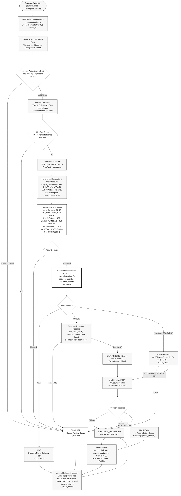

# REVIVE

REVIVE is a risk-aware recovery decision engine for failed Razorpay subscription payments. It detects a failed-payment event, estimates the incremental value of possible recovery actions, applies deterministic safety rules, and either creates a bounded recovery workflow or escalates the case for review.

The system is deliberately designed so that an AI recommendation is never permission to move money. Models estimate outcomes; economics ranks alternatives; policy authorizes; the execution layer is the only component allowed to create an external recovery action.

## What it does today

For a failed subscription payment, REVIVE evaluates four actions:

| Action | Meaning |
| --- | --- |
| `WAIT` | Preserve the gateway's native retry path. |
| `NUDGE` | Generate a recovery message; live delivery integration is not yet enabled. |
| `MANUAL_RECOVERY` | For an eligible live case, create a Razorpay Test Mode Payment Link. |
| `ESCALATE` | Stop automation and create a human-review request. |

The decision flow is:

```text
Razorpay webhook
  -> HMAC verification + idempotent inbox
  -> worker transforms the event into a recovery case
  -> decline diagnosis + live drift screening
  -> calibrated action estimates + uncertainty
  -> incremental-value ranking against WAIT
  -> deterministic policy gate
  -> authorization + durable execution intent
  -> Test Mode Payment Link, wait, or human escalation
  -> provider reconciliation + append-only audit record
```

## Design principles

- **Incremental economics:** interventions are valued against `WAIT`, not against doing nothing in the abstract.
- **Deterministic safety boundary:** hard policy constraints supersede model and LLM recommendations.
- **Fail closed:** invalid authorization, missing Test Mode credentials, provider errors, and detected distribution shift route the case to a safe outcome rather than a simulator fallback.
- **Idempotent side effects:** repeated webhook delivery is accepted without creating a duplicate downstream action.
- **Explicit uncertainty:** the model produces per-action probability and bootstrap uncertainty; risk mode affects ranking, not policy bypass.
- **Auditable outcomes:** decisions retain feature snapshots, model/policy versions, evidence, authorization state, and execution context.

## Safety controls

The policy gate evaluates action feasibility using case facts, not generated text. Current controls include:

- customer opt-out protection;
- recoverable subscription-state checks;
- native-retry collision prevention;
- automatic-action amount ceilings and configurable human-review threshold;
- recovery-attempt budget;
- issued-invoice and payment-method eligibility checks;
- minimum recovery-probability threshold;
- contact-fatigue penalty and daily communication frequency cap (max 1 contact per calendar day);
- quiet-hours communication window enforcement (08:00–19:00 IST);
- post-Governor tone-safety guard (keyword blocklist and sentence length limits);
- authorization TTL and model/policy version validation;
- circuit-breaker protection for manual recovery; and
- live-case drift detection, which routes out-of-distribution cases to `ESCALATE`.

See [Policy Specification](docs/POLICY_SPEC.md) for the policy rules and identifiers.

## Architecture

End-to-end decision and execution flow (see [`revive_flow_clean.mermaid`](revive_flow_clean.mermaid) for the source):



Key boundaries enforced by the diagram:

- **Ingestion boundary:** HMAC verification + PostgreSQL `webhook_events` unique-key inbox; duplicates return HTTP 200 with `status: duplicate` and zero secondary intents.
- **Authorization boundary:** `ExecutionAuthorization` TTL 300s bound to `policy_version`/`model_version`/`event_id`/`action`; stale or mismatched tokens route to `ESCALATE` (`AUTH-VER-001`).
- **Probabilistic vs deterministic authority:** T-Learner and economics are advisory; `PolicyGate` removes infeasible actions before ranking.
- **Post-Governor guard:** Tone safety (keyword blocklist + max 2 sentences) runs after message generation; violation fails closed to `ESCALATE`.
- **Execution boundary:** Atomic `decision_records` + `execution_intents` transaction, claim `PENDING → PROCESSING`, circuit breaker (`CLOSED → OPEN → HALF_OPEN`) gates live calls.
- **Reconciliation boundary:** `UNKNOWN` never blind-retries; async `GET /v1/payment_links/{id}` reconciles to `CONFIRMED`/`FAILED`.

See [Architecture](docs/ARCHITECTURE.md) for the full specification.

## Evaluation: what the numbers mean

REVIVE's batch benchmark uses a **synthetic simulator with counterfactual ground truth**. It is intended to compare recovery policies reproducibly; it is not evidence of production revenue recovered from Razorpay merchants.

The checked-in evaluation snapshot (`data/evaluation/final_results.json`) uses 200 held-out synthetic cases and five simulator seeds:

| Strategy | Mean expected net value | Mean realized net value |
| --- | ---: | ---: |
| Native / `WAIT` | INR 112,305.16 | INR 107,865.80 |
| Rule-based (constrained) | INR 119,590.83 | INR 109,388.40 |
| **REVIVE** | **INR 122,409.35** | **INR 116,737.00** |
| Constrained oracle | INR 124,321.78 | INR 115,766.00 |
| | | |
| Rule-based (unconstrained) | INR 178,299.12 | INR 175,999.40 |
| ML-only (unconstrained) | INR 228,005.53 | INR 248,109.20 |
| Absolute oracle (unconstrained) | INR 233,707.97 | INR 255,644.00 |

The primary comparison is between strategies operating under identical safety constraints (top section). The unconstrained references (bottom section) are included for transparency but are not valid operating policies — they achieve higher raw numbers by ignoring customer opt-out protection, quiet-hours windows (08:00–19:00 IST), daily contact-frequency caps, amount ceilings, and customer fatigue penalties that REVIVE enforces on every decision. The unconstrained rule-based baseline, for example, recovers INR 175,999 only because it would send recovery messages outside permitted hours, re-contact customers who have already been contacted today, and attempt manual recovery on amounts that exceed the merchant's automatic-action ceiling — actions that REVIVE's policy gate correctly blocks.

- **Safe Policy Capture:** 84.76% ± 7.80% (range 74.08%–94.71% across 5 synthetic cohorts; 84.09% on reference seed) — incremental value captured by REVIVE relative to the constrained oracle above the native `WAIT` baseline.
- **Mean decision regret:** INR 7.98 ± INR 4.10 (INR 6.01 on reference seed) per synthetic case.
- **Fair Baseline Comparison:** Under the same policy constraints, REVIVE (INR 116,737) outperforms the rule-based heuristic (INR 109,388) by INR 7,349 — a 6.7% improvement attributable to ML-driven action selection, not constraint relaxation.
- **Constrained Target:** **Constrained Oracle** represents the theoretical maximum achievable under the identical safety policy rules.

For methodology and limitations, read [Evaluation Integrity](docs/EVALUATION_INTEGRITY.md), [Model Card](docs/MODEL_CARD.md), and [Causal Evaluation](docs/CAUSAL_EVALUATION.md).

## Local quick start

### Prerequisites

- Python 3.11+ (the project is currently exercised with Python 3.12)
- `pip`
- Docker and Docker Compose (or a running PostgreSQL 16 instance)

```powershell
python -m venv .venv
.venv\Scripts\Activate.ps1
pip install -r requirements.txt
Copy-Item .env.example .env
```

For the local synthetic workflow, Razorpay and Groq credentials are not required.

Start the database, run migrations, generate data, train the model, and calculate the dashboard benchmark:

```powershell
docker compose up -d db
python scripts/migrate_db.py   # or: make db-migrate
python scripts/generate_data.py
python scripts/train_model.py
python scripts/evaluate_final.py
```

Start the Control Room:

```powershell
uvicorn app.main:app --reload --port 8000
```

Open [http://localhost:8000](http://localhost:8000). Useful local endpoints include:

- `GET /api/health` — process health.
- `GET /api/evaluation` — checked-in/current benchmark results.
- `POST /api/run-case` — evaluate an event ID from `data/generated/eval_cases.csv`.
- `GET /api/replay/{case_id}` — synthetic counterfactual action values.
- `GET /api/audit` — recent non-preview decision records.
- `GET /api/approvals/pending` — unresolved escalation requests.
- `GET` / `PUT /api/merchant-config` — persisted merchant risk and intervention controls.

Example case evaluation:

```powershell
Invoke-RestMethod http://localhost:8000/api/run-case `
  -Method Post `
  -ContentType 'application/json' `
  -Body '{"event_id":"EVT-00557","risk_mode":"BALANCED"}'
```

`risk_mode` is a request-scoped preview. It does not change the persisted merchant configuration or transform the preview into a live payment action.

## Razorpay Test Mode workflow

REVIVE supports a bounded live path for webhook-derived cases. Set credentials only in `.env` or deployment secrets:

```dotenv
RAZORPAY_KEY_ID=rzp_test_...
RAZORPAY_KEY_SECRET=...
RAZORPAY_WEBHOOK_SECRET=...
ENABLE_TESTMODE_EXECUTION=true
```

The expected live sequence is:

1. Razorpay delivers a signed webhook to `POST /api/webhook/razorpay`.
2. REVIVE verifies the raw-body HMAC and stores the event once in its durable inbox.
3. The worker processes the unique event as `is_live=true`.
4. Only a policy-approved `MANUAL_RECOVERY` case may create a Test Mode Payment Link.
5. Link creation means **payment pending**, not recovered revenue.
6. A later Razorpay event or provider query must reconcile the outcome as confirmed, failed, or unknown.

Never commit these credentials. A public deployment should keep the webhook endpoint signature-protected, rate-limited, and separate from the judge-facing demo surface.

## Verification

Run the core quality gates after behavioral changes:

```powershell
pytest -q
python scripts/run_adversarial.py
python scripts/run_property_tests.py
python scripts/reliability_drills.py
python scripts/evaluate_ope.py
python scripts/evaluate_calibration.py
python scripts/evaluate_ci.py
python scripts/evaluate_risk_sensitivity.py
python scripts/evaluate_scenarios.py
python scripts/evaluate_causal.py
python scripts/evaluate_utility_profiles.py
python scripts/evaluate_seed_sensitivity.py
python scripts/rehearse_failure_injection.py
```

Latest verification performed on 2026-08-31:

- `pytest -q`: **63 passed** (including engine-level RBAC append-only proofs, crash-resilient outbox recovery, atomic inbox deduplication, quiet hours, daily contact caps, and failure-injection drills).
- Adversarial, property, reliability, OPE, calibration, confidence-interval, risk-sensitivity, scenario, causal, and merchant-utility scripts were run and verified.
- The signed-webhook Test Mode lifecycle proof (`scripts/test_razorpay_lifecycle.py`) executes cleanly end-to-end: verifying webhook ingestion, targeted worker processing, `MANUAL_RECOVERY` decision generation, `ExecutionAuthorization` audit ledger logging, atomic outbox intent claim, real Razorpay Test Mode payment link creation, and duplicate webhook idempotency.
- Standalone payment link creation endpoints have been removed from the API surface so all external side effects flow strictly through the authorized outbox executor.

Run the live smoke test when you want to exercise Test Mode and have reviewed the configured credentials:

```powershell
python scripts/test_razorpay_lifecycle.py
```

## Repository map

| Area | Location |
| --- | --- |
| HTTP API and Control Room | `app/api/routes.py`, `app/api/webhooks.py`, `frontend/index.html` |
| Recovery orchestration | `app/pipeline.py`, `app/agents/recovery_agent.py` |
| Economics, policy, and diagnosis | `app/economics.py`, `app/policy/gate.py`, `app/diagnosis.py` |
| Messaging (post-Governor) | `app/messaging.py` (template + tone guard) |
| Drift detection | `app/monitoring/drift.py` (PSI z>3 + range check) |
| Webhooks, execution, and reconciliation | `app/events/signature.py`, `app/events/idempotency.py`, `app/execution/authorization.py`, `app/execution/outbox.py`, `app/execution/live_executor.py`, `app/execution/circuit_breaker.py`, `app/execution/reconciliation.py`, `scripts/worker.py` |
| Audit, approvals, receipts, and configuration | `app/audit/logger.py`, `app/approval.py`, `app/receipt.py`, `app/db.py`, `schema.sql` |
| Decision versioning & replay | `app/decision/versioning.py`, `app/decision/replay.py` |
| Training and evaluation | `app/models/calibrated_tlearner.py`, `app/evaluation/`, `scripts/generate_data.py`, `scripts/train_model.py`, `scripts/evaluate_final.py` |
| Tests | `tests/` |
| Mermaid source | `revive_flow_clean.mermaid` (rendered above) |

## Operational boundaries

- The primary benchmark is synthetic; it must not be presented as measured production revenue.
- Live execution creates a customer-facing Test Mode Payment Link; it does not directly charge a customer or claim recovery before reconciliation.
- `NUDGE` message generation exists, but no production email/SMS delivery provider is wired.
- PostgreSQL 16 is the sole persistence backend with database-enforced role privileges (`revive_app` granted `SELECT` and `INSERT` only on `audit_logs`, with `UPDATE`/`DELETE` strictly revoked at the database engine level; migrations run via `revive_admin`).
- The optional LLM is used for diagnosis/recommendation fallback and template personalization. Deterministic policy and execution controls remain authoritative when it is unavailable.

## Documentation

All files below are directly linked from the README and verified present (per `error.md`):

- [Architecture](docs/ARCHITECTURE.md)
- [Policy Specification](docs/POLICY_SPEC.md)
- [Model Card](docs/MODEL_CARD.md)
- [Evaluation Integrity](docs/EVALUATION_INTEGRITY.md)
- [Causal Evaluation](docs/CAUSAL_EVALUATION.md)
- [Razorpay Mapping and Claim Boundaries](docs/RAZORPAY_MAPPING.md)
- [Reliability Model](docs/RELIABILITY.md)
- [Failure Postmortem](docs/FAILURE_POSTMORTEM.md)
- [Live Failure Injection Guide](docs/LIVE_FAILURE_INJECTION.md)
- [Demo Script](docs/DEMO_SCRIPT.md)
- [QA Preparation](docs/QA_PREP.md)
